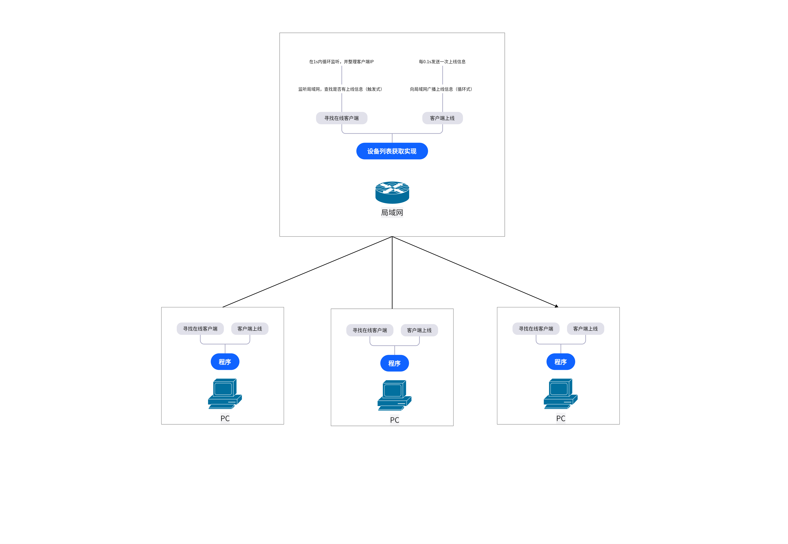

# MarchHelper 简介

MarchHelper，是一款基于 [Tauri](https://tauri.app/zh-cn) `目前`由OldGodShen开发。

>此项目是一个局域网助手（可能？）

## 开发中的功能
    文件传输
    信息传输

## 后端业务逻辑
   

## Recommended IDE Setup

- [VS Code](https://code.visualstudio.com/) + [Volar](https://marketplace.visualstudio.com/items?itemName=Vue.volar) + [Tauri](https://marketplace.visualstudio.com/items?itemName=tauri-apps.tauri-vscode) + [rust-analyzer](https://marketplace.visualstudio.com/items?itemName=rust-lang.rust-analyzer)
